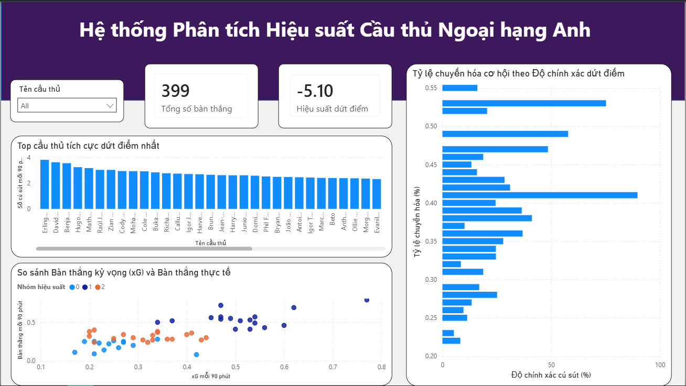

# 🏆 Premier League Data Pipeline & Analytics System

[](https://github.com/YOUR_GITHUB_USERNAME/YOUR_REPO_NAME/actions)

## 📌 Project Overview
Hệ thống tự động hóa luồng dữ liệu (End-to-End Data Pipeline) từ việc thu thập thống kê cầu thủ Ngoại hạng Anh, xử lý làm sạch, phân cụm bằng Machine Learning đến trực quan hóa báo cáo. Dự án được thiết kế để vận hành 100% tự động hàng tuần thông qua GitHub Actions.

## 🏗 System Architecture
Hệ thống được xây dựng theo mô hình kiến trúc dữ liệu hiện đại:
1. **Data Ingestion**: Sử dụng **Selenium (Headless mode)** để cào dữ liệu thô từ The Analyst.
2. **Data Transformation (ETL)**: Làm sạch, chuẩn hóa logic và thực hiện **K-Means Clustering** để phân loại cầu thủ.
3. **Storage**: Lưu trữ Master Data vào **SQLite Database** (quản lý lịch sử) và xuất **Cleaned CSV** phục vụ báo cáo.
4. **Automation**: **GitHub Actions** điều phối (Orchestration) toàn bộ quy trình chạy định kỳ.
5. **Visualization**: **Power BI Dashboard** phân tích hiệu suất chuyên sâu (Goals vs xG, Efficiency).


## 🛠 Tech Stack
- **Language**: Python (Pandas, Scikit-learn, Selenium).
- **Database**: SQLite.
- **CI/CD/Automation**: GitHub Actions.
- **Visualization**: Power BI (DAX, Advanced Analytics).
- **Environment**: Chrome WebDriver (Headless).

## 📊 Key Features & Analytics
- **K-Means Clustering**: Tự động phân nhóm cầu thủ thành 3 phân khúc: *Clinical Finishers* (Sát thủ), *Efficient Scorers* (Hiệu quả), và *Potential Talents* (Tiềm năng).
- **Advanced Metrics**: Tính toán các chỉ số nâng cao như `Goals per 90`, `xG Efficiency`, và `Shot Accuracy`.
- **Historical Tracking**: Bảng `player_stats_history` trong SQLite cho phép theo dõi sự thay đổi phong độ của cầu thủ theo thời gian.
- **Automated Workflow**: Tự động cập nhật dữ liệu vào 00:00 Thứ Hai hàng tuần (Giờ UTC).

## 🚀 Installation & Usage

1. **Clone project:**
   ```bash
   git clone [https://github.com/YOUR_GITHUB_USERNAME/YOUR_REPO_NAME.git](https://github.com/YOUR_GITHUB_USERNAME/YOUR_REPO_NAME.git)
   cd YOUR_REPO_NAME
2. **Install Dependencies:**
   ```bash
   pip install -r requirements.txt
3. **Run Locally:**
   ```bash
   python main.py


